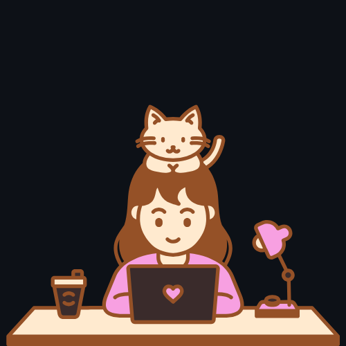

## 
### 🎓 Estudante de análise e desenvolvimento de sistemas.

Busco estágio em desenvolvimento web front-end. Sou muito paciente e dedicada no que faço, sempre em busca de aprender e me aperfeiçoar cada vez mais.

 

    <h2>Meus conhecimentos</h2>
    
    
    
    
      

    
  <a href="https://github.com/GiovannaBaptistaJ">
  
 

 

 

## Meu portfólio

## Onde me encontrar:

  
  

